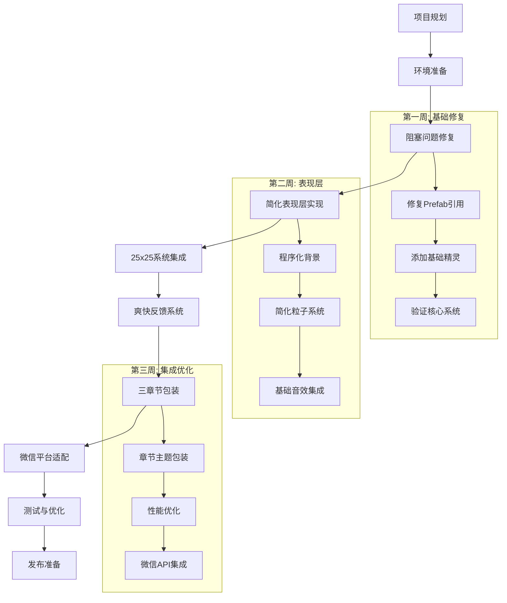
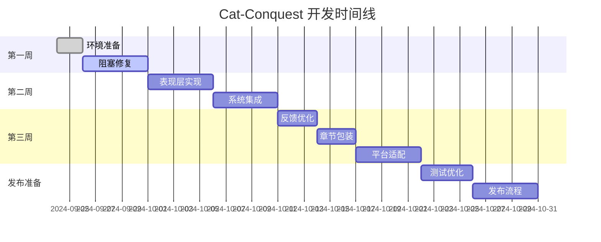

# Cat-Conquest 项目总体规划 (Master Plan)

**项目定位**: 微信小游戏 - 保持25x25系统深度，简化表现层实现  
**开发理念**: "Never break userspace" - 所有已完成系统保持100%不变  
**时间投入**: 每日2-3小时，预计3周完成MVP  

## 🎯 项目状态总览

### 已完成系统 (Priority 0-15) ✅
- **核心深度**: 25种球效果 × 25种砖块类型 = 625种交互组合
- **Build系统**: 20+种流派组合，包含5种"神级"完整构建
- **技术架构**: Cocos Creator 3.x + TypeScript + WeChat Mini Game
- **系统完整性**: 92.1%测试通过率 (93/101 tests)

### 当前阻塞点 🔴
- **Prefab引用缺失**: GameManager中Ball.prefab, Brick.prefab, Paddle.prefab为null
- **精灵帧缺失**: 所有预制体的_spriteFrame为null，对象不可见
- **表现层复杂度**: AI生成艺术工作流过于复杂，不适合快速开发

## 📋 总体开发流程



## 🗂️ 开发阶段详解

### 阶段1: 项目规划与准备 (已完成)
**目标**: 建立清晰的开发路径和文件组织结构
- [x] 项目文件重新分类整理
- [x] 制定总体规划和子计划
- [x] 建立每日开发跟踪机制

### 阶段2: 环境准备 (Day 1-2, 4-6h)
**目标**: 确保开发环境和工具链正常工作

**开发流程**:
```
Day 1 (2h): Cocos Creator项目验证
- 验证Cocos Creator 3.8.6安装
- 检查项目配置和依赖
- 验证微信开发者工具集成

Day 2 (2h): 开发工具链设置
- Claude Code工作流优化
- 版本控制策略确认
- 开发文档模板建立
```

**技术验证点**:
- [ ] 项目能在Cocos Creator中正常打开
- [ ] 微信开发者工具能识别项目
- [ ] TypeScript编译无错误

### 阶段3: 阻塞问题修复 (Day 3-7, 10h)
**目标**: 解决当前阻止项目运行的关键技术问题

**核心修复任务**:
```
Day 3 (3h): Prefab引用修复
- 在GameScene中正确分配Ball.prefab引用
- 分配Brick.prefab和Paddle.prefab引用  
- 分配PowerUp预制体引用

Day 4 (2h): 精灵帧解决方案
- 创建最简单的颜色精灵 (25种球 = 25种颜色)
- 为25种砖块创建基础颜色方案
- 测试精灵显示和碰撞

Day 5-7 (5h): 系统验证
- 验证25种球效果逻辑正确性
- 测试25种砖块交互机制
- 确认Build系统触发条件
```

**关键验证**:
- [ ] 所有对象在场景中可见
- [ ] 基础碰撞物理正常工作
- [ ] 至少5种球效果可以正常触发

### 阶段4: 简化表现层实现 (Day 8-12, 10h)
**目标**: 为25x25系统建立简单但有效的视觉反馈

**表现层策略**:
```
程序化背景生成:
- 第一章: 绿色渐变 + 简单粒子叶片
- 第二章: 灰色山峰轮廓 + 云雾效果  
- 第三章: 深色星空 + 虚空漩涡

音效处理:
- 使用freesound.org免费音效库
- 为25种球效果分配独特音效
- 基础UI音效 (点击、成功、失败)
```

**实现重点**:
- [ ] 每种球效果有独特的视觉标识
- [ ] 每种砖块破坏有满足感反馈
- [ ] 连击系统有爽快的数字弹出

### 阶段5: 25x25系统完整集成 (Day 13-17, 10h)
**目标**: 确保所有球效果和砖块类型正常工作并有反馈

**集成验证**:
```
球效果验证 (每天5种):
Day 13: Normal, Heavy, Soft, Fire, Ice
Day 14: Electric, Poison, Explosive, Piercing, Splitting  
Day 15: Magnetic, Phase, Gravity, Time, Healing
Day 16: Cursed, Light, Dark, Crystal, Rubber
Day 17: Metal, Void, Plasma, Quantum, Chaos
```

**质量标准**:
- [ ] 每种效果有独特的表现
- [ ] 球与砖块交互产生正确结果
- [ ] Build流派能够正确形成

### 阶段6: 爽快反馈系统 (Day 18-20, 6h)
**目标**: 让每次碰撞都有满足感，突出25x25系统的独特性

**反馈层级**:
```
基础反馈: 音效 + 粒子 + 震动
连击反馈: 数字放大 + 颜色变化
Build完成: 全屏特效 + 史诗音效
```

**实现重点**:
- [ ] 即时反馈 (16ms内响应)
- [ ] 渐进放大 (连击越高效果越强)
- [ ] 个性化差异 (每种效果独特)

### 阶段7: 三章节主题包装 (Day 21-23, 6h)
**目标**: 用简单的主题包装展示不同层次的系统深度

**章节设计**:
```
第一章 - 翠绿森林: 基础球效果展示
第二章 - 岩石山峰: 进阶组合和Build形成
第三章 - 虚空深渊: 终极Build和完整系统
```

### 阶段8: 微信平台适配 (Day 24-26, 6h)
**目标**: 确保在微信小游戏平台上流畅运行

**适配重点**:
- [ ] 性能优化 (<200MB内存)
- [ ] 包大小控制 (<20MB)
- [ ] 微信API集成 (支付、广告)
- [ ] 多设备适配测试

### 阶段9: 测试与优化 (Day 27-30, 8h)
**目标**: 发布前的质量保证和最终优化

### 阶段10: 发布准备 (Day 31-35, 10h)
**目标**: 微信小游戏商店发布所需的所有准备工作

## 🎮 非代码流程

### 美术资源流程
1. **概念确认**: 简化美术风格 (纯色 + 几何形状)
2. **资源创建**: 程序化生成背景，手工制作UI图标
3. **资源集成**: FreeTexturePacker打包，Cocos Creator导入
4. **视觉测试**: 不同设备上的显示效果验证

### 音频资源流程
1. **音效库筛选**: freesound.org + 免费游戏音效库
2. **音效处理**: Audacity简单编辑和格式转换
3. **音效集成**: Cocos Creator AudioEngine集成
4. **音量平衡**: 各类音效的音量和优先级调整

### 测试流程
1. **单元测试**: 保持现有92.1%测试通过率
2. **功能测试**: 25x25系统的完整交互验证
3. **性能测试**: 微信平台上的帧率和内存测试
4. **用户测试**: 小范围用户的爽快感反馈

### 发布流程
1. **微信开发者账号**: 注册和认证
2. **版本提交**: 小游戏代码包上传
3. **审核流程**: 微信平台审核配合
4. **发布策略**: 软启动 -> 灰度发布 -> 全量发布

## 🎯 成功标准

### 技术标准
- [ ] 25种球效果100%可用
- [ ] 25种砖块机制100%可用  
- [ ] 至少15种Build流派可完整体验
- [ ] 60fps稳定运行
- [ ] <200MB内存使用

### 体验标准  
- [ ] 每种球效果有独特爽快反馈
- [ ] 连击系统有满足感
- [ ] Build完成有成就感
- [ ] 学习曲线合理 (30秒上手，30分钟沉迷)

### 商业标准
- [ ] 微信小游戏审核通过
- [ ] 支付和广告功能正常
- [ ] 用户留存率 >70% (Day 1)
- [ ] 平均会话时长 >10分钟

## 🚨 风险管控

### 技术风险
**风险1**: 25x25系统性能问题  
**缓解**: 对象池 + LOD系统 + 动态质量调节  
**后备**: 减少同时显示效果数量

**风险2**: 微信平台限制  
**缓解**: 分阶段适配测试  
**后备**: 功能降级但保持核心机制

### 进度风险
**风险1**: 每日2-3小时时间不足  
**缓解**: 优先级严格控制，核心功能优先  
**后备**: 延长1周作为缓冲期

**风险2**: 复杂度低估  
**缓解**: 每日进度跟踪，及时调整  
**后备**: 减少章节数量但保持系统深度

## 📈 项目里程碑



---

**总结**: 这个项目的核心价值在于25x25球砖交互系统的深度设计。通过简化表现层而非简化机制，我们能在3周内完成一个有真正深度的微信小游戏。

**下一步**: 开始执行Day 1的环境验证任务。