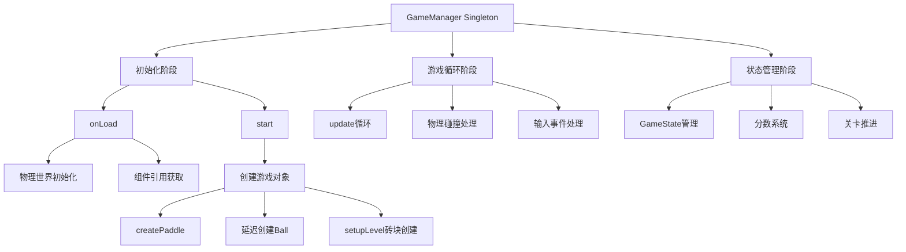
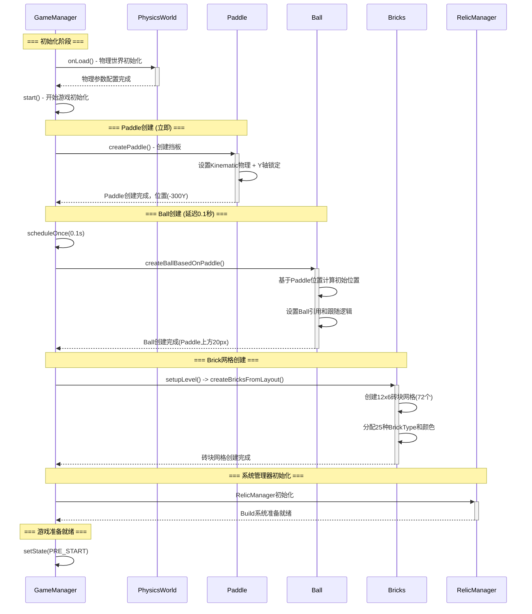
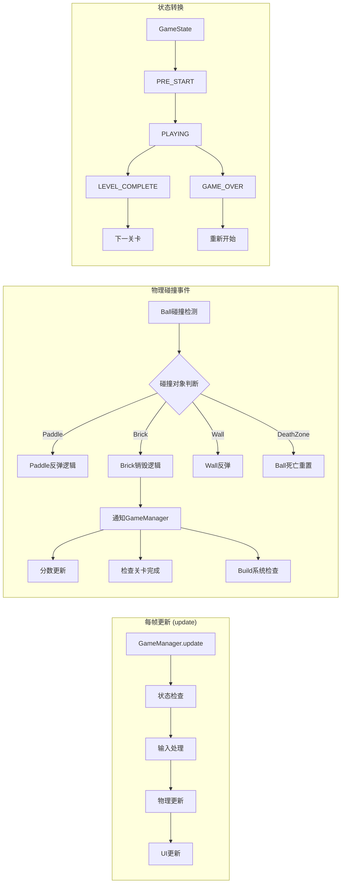
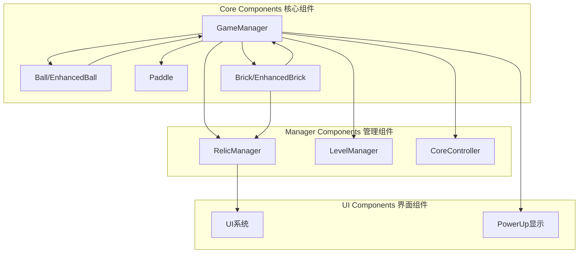
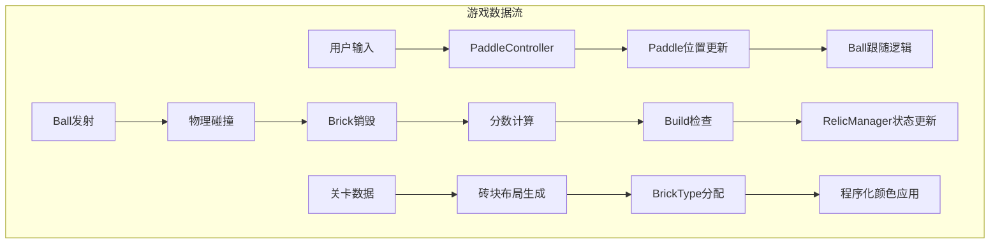

# GameManager 架构分析与调用时序

**分析目标**: 理解GameManager的组件交互关系和初始化时序，为系统验证提供技术基础

## 🏗️ GameManager 核心架构

## ⏱️ 详细初始化时序流程

## 🔄 运行时调用关系

## 🧩 组件依赖关系

## 📊 关键数据流

## 🎯 核心技术特征

### 1. 初始化时序控制
- **延迟创建机制**: Paddle先创建 → 延迟0.1s → Ball基于Paddle位置创建
- **引用传递**: 避免节点查找，直接传递对象引用
- **防御性编程**: 每步都有null检查和错误处理

### 2. 物理约束机制  
- **多重保护**: Prefab配置 + 代码强制 + 位置锁定
- **Y轴锁定**: Paddle每帧强制恢复到固定Y位置
- **碰撞矩阵**: 9x9碰撞组精确控制交互关系

### 3. 25x25系统集成
- **枚举驱动**: BallType和BrickType枚举控制所有交互
- **程序化颜色**: 每种类型有独特的颜色标识
- **Build系统**: RelicManager追踪组合状态

## 🔍 潜在验证点

### P0 基础验证
1. **初始化顺序**: Paddle → Ball → Bricks 是否按预期执行
2. **Prefab引用**: 三个核心prefab是否正确分配到GameManager
3. **物理碰撞**: Ball-Paddle-Brick-Wall基础碰撞是否正常

### P1 系统验证  
1. **程序化颜色**: 25种Ball和25种Brick颜色是否正确显示
2. **Build识别**: RelicManager是否正确追踪玩家状态
3. **状态转换**: GameState是否在适当时机正确转换

### P2 性能验证
1. **帧率稳定**: 72个砖块同时存在时是否保持60fps
2. **内存使用**: 对象池和垃圾回收是否高效
3. **错误处理**: 异常情况下系统是否稳定降级

---

**架构总结**: GameManager采用单例模式作为核心协调器，通过精确的初始化时序和直接引用传递，确保25x25系统的稳定运行。关键在于物理约束的多重保护和程序化颜色的枚举驱动设计。