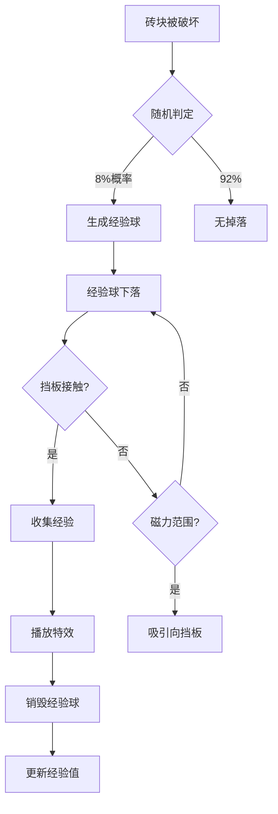

# 经验球系统实施计划 (Experience Orb System)

**系统目标**: 经验球掉落、收集与反馈机制
**优先级**: P1 - 配合等级系统
**预计工期**: 2天 (Day 4-5, 每天2-3小时)

---

## 📊 系统设计概览

### 核心流程


### 经验球类型设计

| 类型 | 经验值 | 掉落概率 | 视觉效果 | 特殊效果 |
|------|--------|---------|---------|---------|
| 小经验球 | 10 | 70% | 绿色小球 (16×16) | 普通下落 |
| 中经验球 | 25 | 20% | 蓝色中球 (24×24) | 缓慢下落 |
| 大经验球 | 50 | 8% | 金色大球 (32×32) | 发光效果 |
| 稀有经验球 | 100 | 2% | 彩虹球 (40×40) | 闪烁+吸引 |

### 掉落概率设计

**基础概率**: 8% (每个砖块破坏时)
**难度加成**: +0.5% per level (最多+15%)
**连击加成**:
- 5连击: +2%
- 10连击: +5%
- 20连击: +10%

**特殊砖块掉落率**:
- EXPERIENCE砖: 100%掉落
- REINFORCED砖: 15%掉落
- BOSS砖块: 50%掉落大经验球

---

## 🎯 实施计划分解

### Day 4: 经验球Prefab与生成 (3小时)

#### Step 1: 创建经验球Prefab (1h)

**文件**: `assets/prefabs/ExperienceOrb.prefab`

**Prefab结构**:
```
ExperienceOrb (Node)
├── Sprite (绿色圆形, 16×16)
├── UITransform (16×16)
├── RigidBody2D (Dynamic, Gravity Scale 0.5)
├── CircleCollider2D (Radius 8, IsSensor true)
└── ExperienceOrb (Script)
```

**编辑器操作清单**:
- [ ] 创建ExperienceOrb.prefab
- [ ] 添加Sprite组件 (临时用绿色矩形)
  - Color: (0, 255, 0, 255)
  - Size: 16×16
- [ ] 添加UITransform
  - Width: 16, Height: 16
  - Anchor: (0.5, 0.5)
- [ ] 添加RigidBody2D
  - Type: Dynamic
  - Gravity Scale: 0.5
  - Linear Damping: 0.2
  - Fixed Rotation: true
- [ ] 添加CircleCollider2D
  - Radius: 8
  - IsSensor: true
  - Tag: ExperienceOrb
- [ ] 保存Prefab → **完成后告知我**

---

#### Step 2: ExperienceOrb脚本实现 (1.5h)

**创建**: `assets/scripts/items/ExperienceOrb.ts`

```typescript
import { _decorator, Component, Node, RigidBody2D, Vec2, Vec3, Collider2D, Contact2DType, IPhysics2DContact, tween, Color, Sprite } from 'cc';
const { ccclass, property } = _decorator;

export enum OrbType {
    SMALL = 'small',    // 10经验
    MEDIUM = 'medium',  // 25经验
    LARGE = 'large',    // 50经验
    RARE = 'rare'       // 100经验
}

@ccclass('ExperienceOrb')
export class ExperienceOrb extends Component {
    @property
    public orbType: OrbType = OrbType.SMALL;

    @property
    public expValue: number = 10;

    @property
    public moveSpeed: number = 200;

    @property
    public magneticRadius: number = 150;

    @property
    public autoCollectRadius: number = 50;

    @property
    public lifetime: number = 10; // 10秒后自动销毁

    private _rigidBody: RigidBody2D | null = null;
    private _sprite: Sprite | null = null;
    private _targetPaddle: Node | null = null;
    private _isBeingCollected: boolean = false;
    private _lifeTimer: number = 0;

    protected onLoad(): void {
        this._rigidBody = this.getComponent(RigidBody2D);
        this._sprite = this.getComponent(Sprite);

        // 根据类型初始化
        this.initializeByType();

        // 监听碰撞
        const collider = this.getComponent(Collider2D);
        if (collider) {
            collider.on(Contact2DType.BEGIN_CONTACT, this.onBeginContact, this);
        }

        // 播放生成动画
        this.playSpawnAnimation();
    }

    protected update(dt: number): void {
        this._lifeTimer += dt;

        // 生命周期检查
        if (this._lifeTimer >= this.lifetime) {
            this.destroyWithEffect();
            return;
        }

        // 寻找最近的挡板
        if (!this._targetPaddle) {
            this.findNearestPaddle();
        }

        // 磁力吸引逻辑
        if (this._targetPaddle && !this._isBeingCollected) {
            this.applyMagneticForce();
        }

        // 闪烁提示 (生命周期最后2秒)
        if (this._lifeTimer >= this.lifetime - 2) {
            this.playWarningBlink();
        }
    }

    /**
     * 根据类型初始化属性
     */
    private initializeByType(): void {
        switch (this.orbType) {
            case OrbType.SMALL:
                this.expValue = 10;
                this.setOrbColor(new Color(0, 255, 0, 255)); // 绿色
                break;
            case OrbType.MEDIUM:
                this.expValue = 25;
                this.setOrbColor(new Color(0, 150, 255, 255)); // 蓝色
                this.node.setScale(1.5, 1.5, 1);
                break;
            case OrbType.LARGE:
                this.expValue = 50;
                this.setOrbColor(new Color(255, 215, 0, 255)); // 金色
                this.node.setScale(2, 2, 1);
                this.playGlowEffect();
                break;
            case OrbType.RARE:
                this.expValue = 100;
                this.setOrbColor(new Color(255, 0, 255, 255)); // 彩虹色
                this.node.setScale(2.5, 2.5, 1);
                this.playGlowEffect();
                this.playRainbowEffect();
                break;
        }
    }

    /**
     * 设置球颜色
     */
    private setOrbColor(color: Color): void {
        if (this._sprite) {
            this._sprite.color = color;
        }
    }

    /**
     * 寻找最近的挡板
     */
    private findNearestPaddle(): void {
        const gameManager = GameManager.getInstance();
        if (gameManager) {
            this._targetPaddle = gameManager.getPaddleNode();
        }
    }

    /**
     * 应用磁力效果
     */
    private applyMagneticForce(): void {
        if (!this._targetPaddle || !this._rigidBody) return;

        const distance = Vec3.distance(this.node.position, this._targetPaddle.position);

        // 在磁力范围内
        if (distance <= this.magneticRadius) {
            const direction = new Vec3();
            Vec3.subtract(direction, this._targetPaddle.position, this.node.position);
            direction.normalize();

            // 磁力强度随距离衰减
            const forceMagnitude = this.moveSpeed * (1 - distance / this.magneticRadius);
            const force = new Vec2(direction.x * forceMagnitude, direction.y * forceMagnitude);

            this._rigidBody.applyForceToCenter(force, true);
        }

        // 自动收集范围
        if (distance <= this.autoCollectRadius) {
            this.collectByPaddle();
        }
    }

    /**
     * 碰撞检测
     */
    private onBeginContact(selfCollider: Collider2D, otherCollider: Collider2D, contact: IPhysics2DContact | null): void {
        const otherNode = otherCollider.node;

        // 挡板碰撞收集
        if (otherNode.name.includes('Paddle') || otherNode.getComponent('EnhancedPaddleController')) {
            this.collectByPaddle();
        }
    }

    /**
     * 被挡板收集
     */
    private collectByPaddle(): void {
        if (this._isBeingCollected) return;

        this._isBeingCollected = true;

        // 通知ExperienceManager
        const expManager = ExperienceManager.getInstance();
        if (expManager) {
            expManager.addExperience(this.expValue, `orb_${this.orbType}`);
        }

        // 播放收集动画
        this.playCollectAnimation();
    }

    /**
     * 播放生成动画
     */
    private playSpawnAnimation(): void {
        const originalScale = this.node.scale.clone();
        this.node.setScale(0, 0, 1);

        tween(this.node)
            .to(0.3, { scale: originalScale }, { easing: 'backOut' })
            .start();
    }

    /**
     * 播放收集动画
     */
    private playCollectAnimation(): void {
        const targetPosition = this._targetPaddle?.position || this.node.position;

        tween(this.node)
            .to(0.2, {
                position: targetPosition,
                scale: new Vec3(0.5, 0.5, 1)
            })
            .call(() => {
                this.destroyWithEffect();
            })
            .start();
    }

    /**
     * 发光效果 (大球/稀有球)
     */
    private playGlowEffect(): void {
        if (!this._sprite) return;

        const originalColor = this._sprite.color.clone();
        tween(this._sprite)
            .to(0.5, { color: new Color(255, 255, 255, 255) })
            .to(0.5, { color: originalColor })
            .union()
            .repeatForever()
            .start();
    }

    /**
     * 彩虹效果 (稀有球)
     */
    private playRainbowEffect(): void {
        if (!this._sprite) return;

        const colors = [
            new Color(255, 0, 0),    // 红
            new Color(255, 165, 0),  // 橙
            new Color(255, 255, 0),  // 黄
            new Color(0, 255, 0),    // 绿
            new Color(0, 0, 255),    // 蓝
            new Color(75, 0, 130),   // 靛
            new Color(238, 130, 238) // 紫
        ];

        let colorIndex = 0;
        this.schedule(() => {
            if (this._sprite) {
                this._sprite.color = colors[colorIndex];
                colorIndex = (colorIndex + 1) % colors.length;
            }
        }, 0.2);
    }

    /**
     * 警告闪烁 (即将消失)
     */
    private playWarningBlink(): void {
        if (!this._sprite) return;

        tween(this._sprite)
            .to(0.1, { color: new Color(255, 255, 255, 100) })
            .to(0.1, { color: new Color(255, 255, 255, 255) })
            .union()
            .repeat(10)
            .start();
    }

    /**
     * 销毁并播放特效
     */
    private destroyWithEffect(): void {
        // TODO: 播放消失粒子特效
        console.log(`💫 Experience orb destroyed (${this.expValue} exp)`);
        this.node.destroy();
    }
}
```

---

#### Step 3: 砖块掉落经验球集成 (0.5h)

**修改**: `EnhancedBrick.ts`

```typescript
// 在 EnhancedBrick.ts 中添加经验球掉落逻辑

@property
public experienceDropChance: number = 0.08; // 8%基础概率

@property
public orbTypeWeights: number[] = [0.7, 0.2, 0.08, 0.02]; // 小/中/大/稀有

private onDestroyed(): void {
    // ... 原有破坏逻辑

    // 掉落经验球
    this.tryDropExperienceOrb();

    // ... 其他逻辑
}

private tryDropExperienceOrb(): void {
    // 计算实际掉落概率 (基础概率 + 难度加成)
    const gameManager = GameManager.getInstance();
    const currentLevel = gameManager ? (gameManager as any).level : 1;
    const levelBonus = Math.min(currentLevel * 0.005, 0.15); // 最多+15%

    const finalDropChance = this.experienceDropChance + levelBonus;

    // 随机判定
    if (Math.random() < finalDropChance) {
        const orbType = this.selectOrbType();
        this.dropExperienceOrb(orbType);
    }
}

private selectOrbType(): OrbType {
    const random = Math.random();
    let累积概率 = 0;

    const types = [OrbType.SMALL, OrbType.MEDIUM, OrbType.LARGE, OrbType.RARE];

    for (let i = 0; i < this.orbTypeWeights.length; i++) {
        累积概率 += this.orbTypeWeights[i];
        if (random < 累积概率) {
            return types[i];
        }
    }

    return OrbType.SMALL; // 默认小球
}

private dropExperienceOrb(orbType: OrbType): void {
    const gameManager = GameManager.getInstance();
    if (gameManager && (gameManager as any).spawnExperienceOrb) {
        (gameManager as any).spawnExperienceOrb(this.node.position, orbType);
    }
}
```

**修改**: `GameManager.ts`

```typescript
// 在 GameManager.ts 中添加生成方法

@property(Prefab)
public experienceOrbPrefab: Prefab | null = null;

public spawnExperienceOrb(position: Vec3, orbType: OrbType = OrbType.SMALL): void {
    if (!this.experienceOrbPrefab) {
        console.warn('ExperienceOrb prefab not assigned');
        return;
    }

    const orb = instantiate(this.experienceOrbPrefab);
    orb.setPosition(position);

    // 设置经验球类型
    const orbScript = orb.getComponent('ExperienceOrb');
    if (orbScript) {
        (orbScript as any).orbType = orbType;
    }

    // 添加到场景
    const canvas = this.node.parent;
    if (canvas) {
        canvas.addChild(orb);
    }

    console.log(`✨ Spawned ${orbType} experience orb at ${position}`);
}
```

**编辑器操作清单**:
- [ ] 在GameManager节点上配置experienceOrbPrefab
- [ ] 拖拽ExperienceOrb.prefab到该槽位
- [ ] 保存场景 → **完成后告知我**

---

### Day 5: 经验球优化与特效 (2小时)

#### Step 1: 磁力吸引优化 (0.5h)

**遗物触发磁力扩展**:
```typescript
// 如果玩家有"经验磁力"遗物，扩大吸引范围
private applyMagneticForce(): void {
    let effectiveRadius = this.magneticRadius;

    // 检查遗物
    const relicManager = RelicManager.getInstance();
    if (relicManager && relicManager.hasRelic(RelicType.MAGNETIC_FIELD)) {
        effectiveRadius *= 2; // 范围翻倍
    }

    // ... 原有磁力逻辑，使用effectiveRadius
}
```

#### Step 2: 收集特效增强 (0.5h)

**粒子特效** (临时用Tween代替):
```typescript
private playCollectAnimation(): void {
    // 飘字效果
    this.showFloatingText(`+${this.expValue} EXP`);

    // 光圈扩散
    this.playRippleEffect();

    // 向挡板飞行
    const targetPosition = this._targetPaddle?.position || this.node.position;
    tween(this.node)
        .to(0.2, {
            position: targetPosition,
            scale: new Vec3(0.5, 0.5, 1)
        })
        .call(() => this.destroyWithEffect())
        .start();
}

private showFloatingText(text: string): void {
    // TODO: 创建Label节点显示飘字
    console.log(text);
}

private playRippleEffect(): void {
    // TODO: 创建光圈扩散效果
    const rippleNode = new Node('Ripple');
    rippleNode.setPosition(this.node.position);
    // ... 添加Sprite和动画
}
```

#### Step 3: 连击系统集成 (1h)

**创建**: `assets/scripts/managers/ComboManager.ts`

```typescript
@ccclass('ComboManager')
export class ComboManager extends Component {
    private static _instance: ComboManager | null = null;

    @property
    public comboTimeout: number = 3; // 3秒无破坏则重置

    private _currentCombo: number = 0;
    private _comboTimer: number = 0;
    private _maxCombo: number = 0;

    public static getInstance(): ComboManager | null {
        return ComboManager._instance;
    }

    protected onLoad(): void {
        if (ComboManager._instance === null) {
            ComboManager._instance = this;
            director.addPersistRootNode(this.node);
        } else {
            this.node.destroy();
        }
    }

    protected update(dt: number): void {
        if (this._currentCombo > 0) {
            this._comboTimer += dt;

            if (this._comboTimer >= this.comboTimeout) {
                this.resetCombo();
            }
        }
    }

    /**
     * 增加连击
     */
    public addCombo(): void {
        this._currentCombo++;
        this._comboTimer = 0;

        if (this._currentCombo > this._maxCombo) {
            this._maxCombo = this._currentCombo;
        }

        console.log(`🔥 Combo: ${this._currentCombo}`);

        // 触发连击事件
        this.node.emit('combo-changed', this._currentCombo);

        // 连击奖励经验
        this.grantComboExperience();
    }

    /**
     * 重置连击
     */
    public resetCombo(): void {
        if (this._currentCombo > 0) {
            console.log(`💔 Combo broken at ${this._currentCombo}`);
            this._currentCombo = 0;
            this._comboTimer = 0;

            this.node.emit('combo-reset');
        }
    }

    /**
     * 连击奖励经验
     */
    private grantComboExperience(): void {
        const expManager = ExperienceManager.getInstance();
        if (!expManager) return;

        let bonusExp = 0;

        if (this._currentCombo >= 5 && this._currentCombo < 10) {
            bonusExp = 5;
        } else if (this._currentCombo >= 10 && this._currentCombo < 20) {
            bonusExp = 10;
        } else if (this._currentCombo >= 20) {
            bonusExp = 20;
        }

        if (bonusExp > 0) {
            expManager.addExperience(bonusExp, `combo_${this._currentCombo}`);
        }
    }

    public getCurrentCombo(): number {
        return this._currentCombo;
    }

    public getMaxCombo(): number {
        return this._maxCombo;
    }
}
```

**编辑器操作清单**:
- [ ] 在GameScene中创建ComboManager节点
- [ ] 添加ComboManager组件
- [ ] 保存场景 → **完成后告知我**

---

## 📋 集成检查清单

### Prefab创建
- [ ] ExperienceOrb.prefab (4种类型)
- [ ] 物理组件配置正确
- [ ] 碰撞检测设置

### 脚本实现
- [ ] ExperienceOrb.ts完成
- [ ] 掉落逻辑集成到EnhancedBrick
- [ ] GameManager生成方法添加
- [ ] ComboManager实现

### 编辑器配置
- [ ] ExperienceOrb Prefab引用配置
- [ ] ComboManager节点创建
- [ ] 物理碰撞层配置

### 测试验证
- [ ] 经验球正常掉落 (8%概率)
- [ ] 4种类型球正确生成
- [ ] 磁力吸引效果正常
- [ ] 收集动画流畅
- [ ] 连击系统触发

---

## 🎯 成功标准

1. **掉落机制**:
   - ✅ 砖块破坏8%概率掉落
   - ✅ 4种类型按权重分配
   - ✅ 特殊砖块高掉落率

2. **收集体验**:
   - ✅ 磁力吸引自然流畅
   - ✅ 收集动画有满足感
   - ✅ 视觉反馈清晰

3. **连击系统**:
   - ✅ 连击正确计数
   - ✅ 超时重置机制
   - ✅ 连击奖励经验

---

**完成Day 4编辑器操作后告知我，我将继续Day 5优化实现！**
