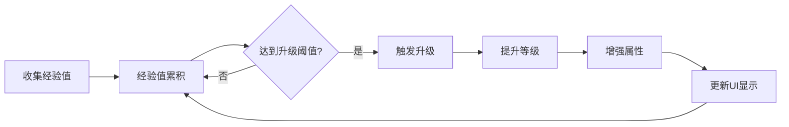

# 等级系统实施计划 (Level System)

**系统目标**: 挡板升级与属性提升系统
**优先级**: P1 - 经验值系统基础
**预计工期**: 3天 (Day 1-3, 每天2-3小时)

---

## 📊 系统设计概览

### 核心概念


### 系统参数设计

| 参数名 | 初始值 | 增长公式 | 上限 | 说明 |
|--------|--------|---------|------|------|
| baseExperience | 100 | `100 * (1.15)^(level-1)` | - | 升级所需经验 |
| moveSpeed | 500 | `500 * (1.05)^level` | 800 | 移动速度 |
| paddleWidth | 120 | `120 * (1.1)^level` | 240 | 挡板宽度 |
| durability | 100 | `100 * (1.08)^level` | 200 | 耐久度上限 |
| repairRate | 2 | `2 * (1.1)^level` | 5 | 修复速度 |

### 经验值来源
1. **经验球收集**: 10经验/个 (8%掉落概率)
2. **砖块破坏**: 根据砖块类型 (1-5经验)
3. **关卡完成**: 50经验 (固定)
4. **连击奖励**: 额外10-50经验 (10连击+)

---

## 🎯 实施计划分解

### Day 1: 经验值管理器 (3小时)

#### Step 1: 创建ExperienceManager单例 (1.5h)

**文件**: `assets/scripts/managers/ExperienceManager.ts`

```typescript
import { _decorator, Component, Node, director } from 'cc';
const { ccclass, property } = _decorator;

export interface LevelConfig {
    level: number;
    expRequired: number;
    rewards: LevelReward[];
}

export interface LevelReward {
    type: 'stat' | 'unlock' | 'skill';
    statName?: string;
    multiplier?: number;
    unlockId?: string;
}

@ccclass('ExperienceManager')
export class ExperienceManager extends Component {
    @property
    public currentExperience: number = 0;

    @property
    public currentLevel: number = 1;

    @property
    public baseExperienceRequired: number = 100;

    @property
    public experienceCurveMultiplier: number = 1.15;

    @property
    public maxLevel: number = 50;

    private static _instance: ExperienceManager | null = null;
    private _experienceToNextLevel: number = 100;
    private _totalExperienceEarned: number = 0;

    public static getInstance(): ExperienceManager | null {
        return ExperienceManager._instance;
    }

    protected onLoad(): void {
        if (ExperienceManager._instance === null) {
            ExperienceManager._instance = this;
            director.addPersistRootNode(this.node);
            this.calculateNextLevelExp();
        } else {
            this.node.destroy();
        }
    }

    protected onDestroy(): void {
        if (ExperienceManager._instance === this) {
            ExperienceManager._instance = null;
        }
    }

    /**
     * 添加经验值
     */
    public addExperience(amount: number, source: string = 'unknown'): void {
        this.currentExperience += amount;
        this._totalExperienceEarned += amount;

        console.log(`📈 +${amount} EXP (${source}) | ${this.currentExperience}/${this._experienceToNextLevel}`);

        // 检查是否升级
        while (this.currentExperience >= this._experienceToNextLevel && this.currentLevel < this.maxLevel) {
            this.levelUp();
        }

        // 触发UI更新事件
        this.node.emit('experience-changed', {
            current: this.currentExperience,
            required: this._experienceToNextLevel,
            progress: this.getExperienceProgress()
        });
    }

    /**
     * 升级处理
     */
    private levelUp(): void {
        // 扣除经验值
        this.currentExperience -= this._experienceToNextLevel;
        this.currentLevel++;

        // 重新计算下一级所需经验
        this.calculateNextLevelExp();

        console.log(`🎉 Level Up! Now Level ${this.currentLevel}`);

        // 应用等级奖励
        this.applyLevelRewards(this.currentLevel);

        // 触发升级事件 (触发升级选择界面)
        this.node.emit('level-up', {
            level: this.currentLevel,
            rewards: this.getLevelRewards(this.currentLevel)
        });
    }

    /**
     * 计算下一级所需经验
     */
    private calculateNextLevelExp(): void {
        this._experienceToNextLevel = Math.floor(
            this.baseExperienceRequired * Math.pow(this.experienceCurveMultiplier, this.currentLevel - 1)
        );
    }

    /**
     * 应用等级奖励 (自动属性提升)
     */
    private applyLevelRewards(level: number): void {
        // 每5级自动提升挡板属性
        if (level % 5 === 0) {
            const gameManager = GameManager.getInstance();
            const paddle = gameManager?.getPaddleNode();
            if (paddle) {
                const paddleController = paddle.getComponent('EnhancedPaddleController');
                if (paddleController) {
                    // 自动提升移动速度5%
                    (paddleController as any).moveSpeed *= 1.05;
                    console.log(`⚡ Auto-upgrade: Move speed +5%`);
                }
            }
        }
    }

    /**
     * 获取等级奖励配置
     */
    private getLevelRewards(level: number): LevelReward[] {
        // 每级可选的奖励
        const rewards: LevelReward[] = [
            { type: 'stat', statName: 'moveSpeed', multiplier: 1.1 },
            { type: 'stat', statName: 'paddleWidth', multiplier: 1.15 },
            { type: 'stat', statName: 'durability', multiplier: 1.1 }
        ];

        // 每10级解锁技能选项
        if (level % 10 === 0) {
            rewards.push({ type: 'unlock', unlockId: `skill_${level}` });
        }

        return rewards;
    }

    // Getter方法
    public getExperienceProgress(): number {
        return this._experienceToNextLevel > 0
            ? this.currentExperience / this._experienceToNextLevel
            : 1.0;
    }

    public getCurrentLevel(): number {
        return this.currentLevel;
    }

    public getExpToNextLevel(): number {
        return this._experienceToNextLevel;
    }

    public getTotalExperience(): number {
        return this._totalExperienceEarned;
    }

    public getRemainingExp(): number {
        return this._experienceToNextLevel - this.currentExperience;
    }

    // 调试方法
    public debugAddLevel(levels: number = 1): void {
        for (let i = 0; i < levels; i++) {
            this.addExperience(this._experienceToNextLevel);
        }
    }
}
```

**编辑器操作清单**:
- [ ] 在GameScene中创建空节点 "ExperienceManager"
- [ ] 添加ExperienceManager组件
- [ ] 配置参数:
  - baseExperienceRequired: 100
  - experienceCurveMultiplier: 1.15
  - maxLevel: 50
- [ ] 保存场景 → **完成后告知我**

---

#### Step 2: Paddle集成经验值系统 (1h)

**修改**: `EnhancedPaddleController.ts`

```typescript
// 在 EnhancedPaddleController 中添加经验值集成

import { ExperienceManager } from '../managers/ExperienceManager';

// 在 onBeginContact 中添加经验球收集逻辑
private onBeginContact(selfCollider: Collider2D, otherCollider: Collider2D, contact: IPhysics2DContact | null): void {
    const otherNode = otherCollider.node;

    // ... 原有逻辑 (Ball碰撞等)

    // 收集经验球
    if (otherNode.name.includes('ExperienceOrb') || otherNode.getComponent('ExperienceOrb')) {
        const expOrb = otherNode.getComponent('ExperienceOrb');
        const expValue = expOrb ? (expOrb as any).expValue : 10;

        // 通知ExperienceManager
        const expManager = ExperienceManager.getInstance();
        if (expManager) {
            expManager.addExperience(expValue, 'experience_orb');
        }

        // 播放收集特效
        this.playExpCollectEffect(otherNode.position);

        // 销毁经验球
        otherNode.destroy();
    }
}

// 添加收集特效方法
private playExpCollectEffect(position: Vec3): void {
    // TODO: 添加粒子特效和音效
    console.log('✨ Experience collected at', position);

    // 临时: 显示飘字效果
    this.showFloatingText('+10 EXP', position);
}

private showFloatingText(text: string, position: Vec3): void {
    // TODO: 实现飘字效果
    console.log(text, 'at', position);
}
```

---

#### Step 3: 经验值UI显示 (0.5h)

**创建**: `assets/scripts/ui/ExperienceBar.ts`

```typescript
import { _decorator, Component, Node, Sprite, Label, tween, Vec3 } from 'cc';
import { ExperienceManager } from '../managers/ExperienceManager';

const { ccclass, property } = _decorator;

@ccclass('ExperienceBar')
export class ExperienceBar extends Component {
    @property(Sprite)
    public fillSprite: Sprite | null = null;

    @property(Label)
    public levelLabel: Label | null = null;

    @property(Label)
    public expLabel: Label | null = null;

    protected onLoad(): void {
        const expManager = ExperienceManager.getInstance();
        if (expManager) {
            expManager.node.on('experience-changed', this.updateBar, this);
            expManager.node.on('level-up', this.onLevelUp, this);
        }

        this.updateBar({ current: 0, required: 100, progress: 0 });
    }

    protected onDestroy(): void {
        const expManager = ExperienceManager.getInstance();
        if (expManager) {
            expManager.node.off('experience-changed', this.updateBar, this);
            expManager.node.off('level-up', this.onLevelUp, this);
        }
    }

    private updateBar(data: { current: number, required: number, progress: number }): void {
        // 更新进度条
        if (this.fillSprite) {
            const targetScale = new Vec3(data.progress, 1, 1);
            tween(this.fillSprite.node)
                .to(0.3, { scale: targetScale })
                .start();
        }

        // 更新经验值文本
        if (this.expLabel) {
            this.expLabel.string = `${data.current}/${data.required}`;
        }
    }

    private onLevelUp(data: { level: number }): void {
        // 更新等级文本
        if (this.levelLabel) {
            this.levelLabel.string = `Lv.${data.level}`;
        }

        // 播放升级动画
        this.playLevelUpAnimation();
    }

    private playLevelUpAnimation(): void {
        if (this.levelLabel) {
            const originalScale = this.levelLabel.node.scale.clone();
            tween(this.levelLabel.node)
                .to(0.2, { scale: originalScale.multiplyScalar(1.5) })
                .to(0.2, { scale: originalScale })
                .start();
        }
    }
}
```

**编辑器操作清单**:
- [ ] 在Canvas下创建ExperienceBar UI (参考DevTools布局)
- [ ] 添加背景Sprite (灰色条)
- [ ] 添加填充Sprite (绿色进度条)
- [ ] 添加等级Label "Lv.1"
- [ ] 添加经验值Label "0/100"
- [ ] 挂载ExperienceBar脚本
- [ ] 配置属性引用
- [ ] 保存场景 → **完成后告知我**

---

### Day 2: 属性提升系统 (3小时)

#### Step 1: 统一属性管理器 (1.5h)

**创建**: `assets/scripts/managers/PlayerStatsManager.ts`

```typescript
import { _decorator, Component, director } from 'cc';
const { ccclass, property } = _decorator;

export interface PlayerStats {
    // 挡板属性
    moveSpeed: number;
    paddleWidth: number;
    durability: number;
    repairRate: number;

    // 球属性
    ballSpeed: number;
    ballDamage: number;
    pierceChance: number;

    // 游戏属性
    lives: number;
    experienceMultiplier: number;
}

@ccclass('PlayerStatsManager')
export class PlayerStatsManager extends Component {
    private static _instance: PlayerStatsManager | null = null;

    private _baseStats: PlayerStats = {
        moveSpeed: 500,
        paddleWidth: 120,
        durability: 100,
        repairRate: 2,
        ballSpeed: 400,
        ballDamage: 1,
        pierceChance: 0,
        lives: 3,
        experienceMultiplier: 1.0
    };

    private _currentStats: PlayerStats = { ...this._baseStats };
    private _statModifiers: Map<string, number> = new Map();

    public static getInstance(): PlayerStatsManager | null {
        return PlayerStatsManager._instance;
    }

    protected onLoad(): void {
        if (PlayerStatsManager._instance === null) {
            PlayerStatsManager._instance = this;
            director.addPersistRootNode(this.node);
        } else {
            this.node.destroy();
        }
    }

    /**
     * 修改属性 (加法)
     */
    public modifyStat(statName: keyof PlayerStats, value: number): void {
        (this._currentStats[statName] as number) += value;
        this.applyStatsToGame();
        console.log(`📊 Stat modified: ${statName} +${value} = ${this._currentStats[statName]}`);
    }

    /**
     * 修改属性 (乘法)
     */
    public multiplystat(statName: keyof PlayerStats, multiplier: number): void {
        (this._currentStats[statName] as number) *= multiplier;
        this.applyStatsToGame();
        console.log(`📊 Stat multiplied: ${statName} ×${multiplier} = ${this._currentStats[statName]}`);
    }

    /**
     * 应用属性到游戏对象
     */
    private applyStatsToGame(): void {
        const gameManager = GameManager.getInstance();
        if (!gameManager) return;

        // 应用到Paddle
        const paddle = gameManager.getPaddleNode();
        if (paddle) {
            const paddleController = paddle.getComponent('EnhancedPaddleController');
            if (paddleController) {
                (paddleController as any).moveSpeed = this._currentStats.moveSpeed;
                (paddleController as any).maxDurability = this._currentStats.durability;
                (paddleController as any).repairRate = this._currentStats.repairRate;

                // 应用宽度变化
                const newWidth = this._currentStats.paddleWidth;
                const baseWidth = this._baseStats.paddleWidth;
                const scaleMultiplier = newWidth / baseWidth;
                paddle.setScale(scaleMultiplier, 1, 1);
            }
        }

        // 应用到Ball
        const ball = gameManager.getBallNode();
        if (ball) {
            const ballController = ball.getComponent('EnhancedBall');
            if (ballController) {
                (ballController as any).baseSpeed = this._currentStats.ballSpeed;
                (ballController as any).baseDamage = this._currentStats.ballDamage;
            }
        }

        // 应用到GameManager
        (gameManager as any).lives = this._currentStats.lives;
    }

    /**
     * 获取当前属性值
     */
    public getStat(statName: keyof PlayerStats): number {
        return this._currentStats[statName] as number;
    }

    /**
     * 重置所有属性
     */
    public resetStats(): void {
        this._currentStats = { ...this._baseStats };
        this.applyStatsToGame();
    }

    /**
     * 获取所有当前属性
     */
    public getAllStats(): PlayerStats {
        return { ...this._currentStats };
    }
}
```

**编辑器操作清单**:
- [ ] 在GameScene中创建空节点 "PlayerStatsManager"
- [ ] 添加PlayerStatsManager组件
- [ ] 保存场景 → **完成后告知我**

---

### Day 3: 测试与优化 (2小时)

#### 测试清单

**基础功能测试**:
- [ ] 收集经验球正常增加经验值
- [ ] 经验值满自动升级
- [ ] 等级显示正确更新
- [ ] 经验条平滑动画

**属性提升测试**:
- [ ] 挡板移动速度提升生效
- [ ] 挡板宽度扩展生效
- [ ] 耐久度上限提升生效
- [ ] 修复速度提升生效

**边界情况测试**:
- [ ] 达到最大等级50后停止升级
- [ ] 经验值不会溢出
- [ ] 属性修改正确应用到所有游戏对象

---

## 📋 集成检查清单

### 代码集成
- [ ] ExperienceManager单例创建
- [ ] PlayerStatsManager单例创建
- [ ] Paddle接入经验球收集
- [ ] 等级奖励系统实现
- [ ] UI显示组件完成

### 编辑器配置
- [ ] ExperienceManager节点配置
- [ ] PlayerStatsManager节点配置
- [ ] ExperienceBar UI创建
- [ ] 属性引用正确配置

### 测试验证
- [ ] 完整升级流程测试
- [ ] 属性提升效果验证
- [ ] UI显示正确性验证
- [ ] 性能无明显下降

---

## 🎯 成功标准

1. **功能完整性**:
   - ✅ 经验值收集机制工作
   - ✅ 等级提升流程正常
   - ✅ 属性提升正确应用

2. **用户体验**:
   - ✅ UI反馈及时清晰
   - ✅ 升级动画流畅
   - ✅ 数值增长可感知

3. **技术质量**:
   - ✅ 代码模块化清晰
   - ✅ 无内存泄漏
   - ✅ 60fps稳定运行

---

**完成Day 1编辑器操作后告知我，我将提供Day 2具体实现代码！**
