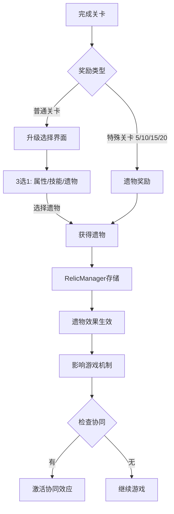

# 遗物系统实施计划 (Relic System)

**系统目标**: Roguelike核心机制 - 永久性被动增强系统
**优先级**: P1 - 配合经验值与等级系统
**预计工期**: 1周 (Day 6-12, 每天2-3小时)

---

## 📊 系统设计概览

### 核心概念


### 遗物稀有度设计

| 稀有度 | 掉落权重 | 典型效果 | 示例 |
|--------|---------|---------|------|
| 普通 (Common) | 50% | 10-20%属性提升 | 移速+15%, 挡板+10% |
| 稀有 (Rare) | 30% | 30-50%增强 + 小机制 | 球速+30% + 5%穿透 |
| 史诗 (Epic) | 15% | 独特机制 | 分裂光环, 吸血 |
| 传说 (Legendary) | 5% | 改变玩法 | 多球发射, 时间减速 |

### 遗物分类系统

**攻击型遗物** (Offensive):
1. **分裂光环** (Split Aura) - 主球碰撞砖块时30%概率生成2个小球 (伤害50%)
2. **连锁爆炸** (Chain Explosion) - 砖块破坏30%概率触发范围爆炸 (半径100px, 伤害1)
3. **穿透大师** (Piercing Master) - 球穿透概率+50%
4. **伤害增幅** (Damage Boost) - 球伤害+50%
5. **速度狂暴** (Speed Fury) - 球速+25%, 伤害+25%

**防御型遗物** (Defensive):
6. **吸血光环** (Lifesteal Aura) - 每破坏10个砖块恢复1生命
7. **护盾强化** (Shield Boost) - 每关开始获得1层护盾 (吸收1次失球)
8. **挡板延长** (Paddle Extension) - 挡板宽度+30%
9. **耐久提升** (Durability Boost) - 挡板耐久+50%
10. **修复加速** (Repair Speed) - 修复速度+100%

**机制型遗物** (Utility):
11. **经验磁力** (Experience Magnet) - 经验球吸引范围×2
12. **多球发射** (Multi-Ball Start) - 每关开始发射3个球
13. **时间减速** (Time Dilation) - 球速-20%, 反应时间+25%
14. **精准控制** (Precision Control) - 挡板移速+20%, 控制更精确
15. **幸运光环** (Lucky Aura) - PowerUp掉落率+50%

**特殊型遗物** (Special):
16. **元素精通** (Elemental Mastery) - 元素球效果+100%
17. **Boss杀手** (Boss Slayer) - 对BOSS砖块伤害+200%
18. **连击大师** (Combo Master) - 连击超时时间+2秒, 连击奖励+50%
19. **贪婪** (Greed) - 经验值×1.5, 但生命-1
20. **玻璃大炮** (Glass Cannon) - 伤害×2, 但挡板耐久-50%

---

## 🎯 实施计划分解

### Day 6: 遗物数据扩展 (2小时)

#### Step 1: 扩展RelicType枚举 (0.5h)

**修改**: `assets/scripts/managers/RelicManager.ts`

```typescript
export enum RelicType {
    // 攻击型 (Offensive)
    SPLIT_AURA = 'split_aura',
    CHAIN_EXPLOSION = 'chain_explosion',
    PIERCING_MASTER = 'piercing_master',
    DAMAGE_BOOST = 'damage_boost',
    SPEED_FURY = 'speed_fury',

    // 防御型 (Defensive)
    LIFESTEAL_AURA = 'lifesteal_aura',
    SHIELD_BOOST = 'shield_boost',
    PADDLE_EXTENSION = 'paddle_extension',
    DURABILITY_BOOST = 'durability_boost',
    REPAIR_SPEED = 'repair_speed',

    // 机制型 (Utility)
    EXPERIENCE_MAGNET = 'experience_magnet',
    MULTI_BALL_START = 'multi_ball_start',
    TIME_DILATION = 'time_dilation',
    PRECISION_CONTROL = 'precision_control',
    LUCKY_AURA = 'lucky_aura',

    // 特殊型 (Special)
    ELEMENTAL_MASTERY = 'elemental_mastery',
    BOSS_SLAYER = 'boss_slayer',
    COMBO_MASTER = 'combo_master',
    GREED = 'greed',
    GLASS_CANNON = 'glass_cannon',

    // 保留原有5个遗物 (已实现)
    EXPLOSIVE_BRICKS = 'explosive_bricks',
    LASER_DAMAGE_BOOST = 'laser_damage_boost',
    BRICK_PENETRATION = 'brick_penetration',
    SPEED_BOOST = 'speed_boost'
}

export enum RelicRarity {
    COMMON = 'common',
    RARE = 'rare',
    EPIC = 'epic',
    LEGENDARY = 'legendary'
}

export interface Relic {
    id: string;
    name: string;
    description: string;
    rarity: RelicRarity;
    category: 'offensive' | 'defensive' | 'utility' | 'special';
    icon?: string;
    stats?: {
        damageMultiplier?: number;
        speedMultiplier?: number;
        pierceChance?: number;
        healPerBricks?: number;
        paddleWidthBonus?: number;
        experienceMultiplier?: number;
    };
}
```

---

#### Step 2: 遗物数据配置表 (1h)

**创建**: `assets/scripts/config/RelicConfig.ts`

```typescript
import { _decorator } from 'cc';
import { RelicType, Relic, RelicRarity } from '../managers/RelicManager';

const { ccclass } = _decorator;

@ccclass('RelicConfig')
export class RelicConfig {
    private static _relicDatabase: Map<RelicType, Relic> = new Map([
        // 攻击型遗物
        [RelicType.SPLIT_AURA, {
            id: 'split_aura',
            name: '分裂光环',
            description: '主球碰撞砖块时30%概率生成2个小球 (伤害50%)',
            rarity: RelicRarity.EPIC,
            category: 'offensive',
            stats: {
                damageMultiplier: 0.5
            }
        }],

        [RelicType.CHAIN_EXPLOSION, {
            id: 'chain_explosion',
            name: '连锁爆炸',
            description: '砖块破坏30%概率触发范围爆炸',
            rarity: RelicRarity.EPIC,
            category: 'offensive',
            stats: {}
        }],

        [RelicType.PIERCING_MASTER, {
            id: 'piercing_master',
            name: '穿透大师',
            description: '球穿透概率+50%',
            rarity: RelicRarity.RARE,
            category: 'offensive',
            stats: {
                pierceChance: 0.5
            }
        }],

        [RelicType.DAMAGE_BOOST, {
            id: 'damage_boost',
            name: '伤害增幅',
            description: '球伤害+50%',
            rarity: RelicRarity.RARE,
            category: 'offensive',
            stats: {
                damageMultiplier: 1.5
            }
        }],

        [RelicType.SPEED_FURY, {
            id: 'speed_fury',
            name: '速度狂暴',
            description: '球速+25%, 伤害+25%',
            rarity: RelicRarity.RARE,
            category: 'offensive',
            stats: {
                speedMultiplier: 1.25,
                damageMultiplier: 1.25
            }
        }],

        // 防御型遗物
        [RelicType.LIFESTEAL_AURA, {
            id: 'lifesteal_aura',
            name: '吸血光环',
            description: '每破坏10个砖块恢复1生命',
            rarity: RelicRarity.EPIC,
            category: 'defensive',
            stats: {
                healPerBricks: 10
            }
        }],

        [RelicType.SHIELD_BOOST, {
            id: 'shield_boost',
            name: '护盾强化',
            description: '每关开始获得1层护盾',
            rarity: RelicRarity.RARE,
            category: 'defensive',
            stats: {}
        }],

        [RelicType.PADDLE_EXTENSION, {
            id: 'paddle_extension',
            name: '挡板延长',
            description: '挡板宽度+30%',
            rarity: RelicRarity.COMMON,
            category: 'defensive',
            stats: {
                paddleWidthBonus: 0.3
            }
        }],

        [RelicType.DURABILITY_BOOST, {
            id: 'durability_boost',
            name: '耐久提升',
            description: '挡板耐久+50%',
            rarity: RelicRarity.COMMON,
            category: 'defensive',
            stats: {}
        }],

        [RelicType.REPAIR_SPEED, {
            id: 'repair_speed',
            name: '修复加速',
            description: '修复速度+100%',
            rarity: RelicRarity.COMMON,
            category: 'defensive',
            stats: {}
        }],

        // 机制型遗物
        [RelicType.EXPERIENCE_MAGNET, {
            id: 'experience_magnet',
            name: '经验磁力',
            description: '经验球吸引范围×2',
            rarity: RelicRarity.RARE,
            category: 'utility',
            stats: {}
        }],

        [RelicType.MULTI_BALL_START, {
            id: 'multi_ball_start',
            name: '多球发射',
            description: '每关开始发射3个球',
            rarity: RelicRarity.LEGENDARY,
            category: 'utility',
            stats: {}
        }],

        [RelicType.TIME_DILATION, {
            id: 'time_dilation',
            name: '时间减速',
            description: '球速-20%, 反应时间+25%',
            rarity: RelicRarity.EPIC,
            category: 'utility',
            stats: {
                speedMultiplier: 0.8
            }
        }],

        [RelicType.PRECISION_CONTROL, {
            id: 'precision_control',
            name: '精准控制',
            description: '挡板移速+20%',
            rarity: RelicRarity.COMMON,
            category: 'utility',
            stats: {}
        }],

        [RelicType.LUCKY_AURA, {
            id: 'lucky_aura',
            name: '幸运光环',
            description: 'PowerUp掉落率+50%',
            rarity: RelicRarity.RARE,
            category: 'utility',
            stats: {}
        }],

        // 特殊型遗物
        [RelicType.ELEMENTAL_MASTERY, {
            id: 'elemental_mastery',
            name: '元素精通',
            description: '元素球效果+100%',
            rarity: RelicRarity.EPIC,
            category: 'special',
            stats: {}
        }],

        [RelicType.BOSS_SLAYER, {
            id: 'boss_slayer',
            name: 'Boss杀手',
            description: '对BOSS砖块伤害+200%',
            rarity: RelicRarity.LEGENDARY,
            category: 'special',
            stats: {
                damageMultiplier: 3.0
            }
        }],

        [RelicType.COMBO_MASTER, {
            id: 'combo_master',
            name: '连击大师',
            description: '连击超时+2秒, 奖励+50%',
            rarity: RelicRarity.RARE,
            category: 'special',
            stats: {}
        }],

        [RelicType.GREED, {
            id: 'greed',
            name: '贪婪',
            description: '经验值×1.5, 但生命-1',
            rarity: RelicRarity.LEGENDARY,
            category: 'special',
            stats: {
                experienceMultiplier: 1.5
            }
        }],

        [RelicType.GLASS_CANNON, {
            id: 'glass_cannon',
            name: '玻璃大炮',
            description: '伤害×2, 但挡板耐久-50%',
            rarity: RelicRarity.LEGENDARY,
            category: 'special',
            stats: {
                damageMultiplier: 2.0
            }
        }]
    ]);

    /**
     * 获取遗物配置
     */
    public static getRelicData(relicType: RelicType): Relic | null {
        return this._relicDatabase.get(relicType) || null;
    }

    /**
     * 根据稀有度获取遗物列表
     */
    public static getRelicsByRarity(rarity: RelicRarity): RelicType[] {
        const relics: RelicType[] = [];
        this._relicDatabase.forEach((data, type) => {
            if (data.rarity === rarity) {
                relics.push(type);
            }
        });
        return relics;
    }

    /**
     * 根据分类获取遗物列表
     */
    public static getRelicsByCategory(category: string): RelicType[] {
        const relics: RelicType[] = [];
        this._relicDatabase.forEach((data, type) => {
            if (data.category === category) {
                relics.push(type);
            }
        });
        return relics;
    }

    /**
     * 获取随机遗物 (按稀有度权重)
     */
    public static getRandomRelic(excludeTypes?: RelicType[]): RelicType | null {
        const rarityWeights = new Map([
            [RelicRarity.COMMON, 0.5],
            [RelicRarity.RARE, 0.3],
            [RelicRarity.EPIC, 0.15],
            [RelicRarity.LEGENDARY, 0.05]
        ]);

        // 按稀有度分组
        const grouped = new Map<RelicRarity, RelicType[]>();
        this._relicDatabase.forEach((data, type) => {
            if (excludeTypes && excludeTypes.includes(type)) return;

            if (!grouped.has(data.rarity)) {
                grouped.set(data.rarity, []);
            }
            grouped.get(data.rarity)!.push(type);
        });

        // 加权随机选择稀有度
        const random = Math.random();
        let累积概率 = 0;
        let selectedRarity: RelicRarity | null = null;

        for (const [rarity, weight] of rarityWeights.entries()) {
            累积概率 += weight;
            if (random < 累积概率) {
                selectedRarity = rarity;
                break;
            }
        }

        // 从该稀有度中随机选择
        if (selectedRarity && grouped.has(selectedRarity)) {
            const pool = grouped.get(selectedRarity)!;
            return pool[Math.floor(Math.random() * pool.length)];
        }

        return null;
    }
}
```

---

#### Step 3: 遗物效果应用系统 (0.5h)

**修改**: `assets/scripts/managers/RelicManager.ts`

```typescript
import { RelicConfig } from '../config/RelicConfig';

@ccclass('RelicManager')
export class RelicManager extends Component {
    // ... 原有代码

    private createRelic(relicType: RelicType): Relic | null {
        return RelicConfig.getRelicData(relicType);
    }

    /**
     * 应用所有遗物效果到游戏
     */
    public applyAllRelicEffects(): void {
        const gameManager = GameManager.getInstance();
        const statsManager = PlayerStatsManager.getInstance();

        if (!gameManager || !statsManager) return;

        // 重置为基础值
        statsManager.resetStats();

        // 遍历所有激活的遗物
        this._activeRelics.forEach((relic, relicType) => {
            this.applyRelicEffect(relicType, relic, statsManager);
        });
    }

    /**
     * 应用单个遗物效果
     */
    private applyRelicEffect(relicType: RelicType, relic: Relic, statsManager: PlayerStatsManager): void {
        const stats = relic.stats || {};

        switch (relicType) {
            case RelicType.DAMAGE_BOOST:
                statsManager.multiplystat('ballDamage', stats.damageMultiplier || 1.5);
                break;

            case RelicType.SPEED_FURY:
                statsManager.multiplystat('ballSpeed', stats.speedMultiplier || 1.25);
                statsManager.multiplystat('ballDamage', stats.damageMultiplier || 1.25);
                break;

            case RelicType.PIERCING_MASTER:
                statsManager.modifyStat('pierceChance', stats.pierceChance || 0.5);
                break;

            case RelicType.PADDLE_EXTENSION:
                statsManager.multiplystat('paddleWidth', 1 + (stats.paddleWidthBonus || 0.3));
                break;

            case RelicType.DURABILITY_BOOST:
                statsManager.multiplystat('durability', 1.5);
                break;

            case RelicType.REPAIR_SPEED:
                statsManager.multiplystat('repairRate', 2.0);
                break;

            case RelicType.PRECISION_CONTROL:
                statsManager.multiplystat('moveSpeed', 1.2);
                break;

            case RelicType.TIME_DILATION:
                statsManager.multiplystat('ballSpeed', stats.speedMultiplier || 0.8);
                break;

            case RelicType.GREED:
                statsManager.multiplystat('experienceMultiplier', stats.experienceMultiplier || 1.5);
                statsManager.modifyStat('lives', -1);
                break;

            case RelicType.GLASS_CANNON:
                statsManager.multiplystat('ballDamage', stats.damageMultiplier || 2.0);
                statsManager.multiplystat('durability', 0.5);
                break;

            // 其他遗物在对应事件中触发 (LIFESTEAL_AURA, CHAIN_EXPLOSION等)
        }

        console.log(`✨ Applied relic effect: ${relic.name}`);
    }

    /**
     * 检查遗物是否触发效果 (用于概率型遗物)
     */
    public shouldTriggerEffect(relicType: RelicType, triggerChance: number = 0.3): boolean {
        if (!this.hasRelic(relicType)) return false;
        return Math.random() < triggerChance;
    }

    /**
     * 获取遗物数值加成
     */
    public getRelicStatBonus(relicType: RelicType, statName: string): number {
        const relic = this.getRelic(relicType);
        if (!relic || !relic.stats) return 0;

        return (relic.stats as any)[statName] || 0;
    }
}
```

**编辑器操作清单**:
- 无需编辑器操作，纯代码扩展

---

### Day 7: 遗物获取机制 (2.5小时)

#### Step 1: 升级选择界面UI (1h)

**创建**: `assets/scripts/ui/LevelUpChoiceUI.ts`

```typescript
import { _decorator, Component, Node, Button, Label, Sprite, instantiate, Prefab } from 'cc';
import { ExperienceManager } from '../managers/ExperienceManager';
import { RelicManager, RelicType, Relic } from '../managers/RelicManager';
import { PlayerStatsManager } from '../managers/PlayerStatsManager';
import { RelicConfig } from '../config/RelicConfig';

const { ccclass, property } = _decorator;

export interface UpgradeOption {
    type: 'stat' | 'relic';
    relicType?: RelicType;
    statName?: string;
    statMultiplier?: number;
    description: string;
}

@ccclass('LevelUpChoiceUI')
export class LevelUpChoiceUI extends Component {
    @property(Node)
    public panel: Node | null = null;

    @property(Node)
    public optionContainer: Node | null = null;

    @property(Prefab)
    public optionCardPrefab: Prefab | null = null;

    @property(Button)
    public skipButton: Button | null = null;

    private _currentOptions: UpgradeOption[] = [];

    protected onLoad(): void {
        const expManager = ExperienceManager.getInstance();
        if (expManager) {
            expManager.node.on('level-up', this.onLevelUp, this);
        }

        if (this.skipButton) {
            this.skipButton.node.on(Button.EventType.CLICK, this.onSkipClicked, this);
        }

        this.panel?.active && (this.panel.active = false);
    }

    protected onDestroy(): void {
        const expManager = ExperienceManager.getInstance();
        if (expManager) {
            expManager.node.off('level-up', this.onLevelUp, this);
        }
    }

    /**
     * 升级触发
     */
    private onLevelUp(data: { level: number }): void {
        this.generateUpgradeOptions(data.level);
        this.showPanel();
    }

    /**
     * 生成3选1选项
     */
    private generateUpgradeOptions(level: number): void {
        this._currentOptions = [];

        // 权重配置
        const weights = {
            stat: 0.6,    // 60%属性提升
            relic: 0.4    // 40%遗物
        };

        for (let i = 0; i < 3; i++) {
            const random = Math.random();

            if (random < weights.stat) {
                this._currentOptions.push(this.generateStatOption());
            } else {
                this._currentOptions.push(this.generateRelicOption());
            }
        }

        this.renderOptions();
    }

    /**
     * 生成属性提升选项
     */
    private generateStatOption(): UpgradeOption {
        const statOptions = [
            { statName: 'paddleWidth', multiplier: 1.15, description: '挡板延长 +15%' },
            { statName: 'moveSpeed', multiplier: 1.1, description: '移动速度 +10%' },
            { statName: 'ballSpeed', multiplier: 0.95, description: '球速减慢 -5%' },
            { statName: 'ballDamage', multiplier: 1.25, description: '球伤害 +25%' },
            { statName: 'durability', multiplier: 1.2, description: '耐久度 +20%' },
            { statName: 'lives', multiplier: 1, description: '生命 +1' }
        ];

        const selected = statOptions[Math.floor(Math.random() * statOptions.length)];
        return {
            type: 'stat',
            statName: selected.statName,
            statMultiplier: selected.multiplier,
            description: selected.description
        };
    }

    /**
     * 生成遗物选项
     */
    private generateRelicOption(): UpgradeOption {
        const relicManager = RelicManager.getInstance();
        const excludeTypes = relicManager ? relicManager.getActiveRelics().map(r => RelicConfig.getRelicData(r.id as RelicType)) : [];

        const relicType = RelicConfig.getRandomRelic(excludeTypes.filter(r => r !== null) as RelicType[]);

        if (!relicType) {
            // 如果没有可用遗物，返回属性提升
            return this.generateStatOption();
        }

        const relicData = RelicConfig.getRelicData(relicType);

        return {
            type: 'relic',
            relicType: relicType,
            description: relicData ? `${relicData.name}: ${relicData.description}` : '未知遗物'
        };
    }

    /**
     * 渲染选项卡片
     */
    private renderOptions(): void {
        if (!this.optionContainer || !this.optionCardPrefab) return;

        this.optionContainer.removeAllChildren();

        this._currentOptions.forEach((option, index) => {
            const card = instantiate(this.optionCardPrefab!);

            // 设置描述文本
            const label = card.getComponentInChildren(Label);
            if (label) {
                label.string = option.description;
            }

            // 绑定点击事件
            const button = card.getComponent(Button);
            if (button) {
                button.node.on(Button.EventType.CLICK, () => {
                    this.onOptionSelected(index);
                }, this);
            }

            this.optionContainer.addChild(card);
        });
    }

    /**
     * 选项被选择
     */
    private onOptionSelected(index: number): void {
        const option = this._currentOptions[index];

        if (option.type === 'stat') {
            this.applyStatUpgrade(option);
        } else if (option.type === 'relic') {
            this.applyRelicUpgrade(option);
        }

        this.hidePanel();
    }

    /**
     * 应用属性提升
     */
    private applyStatUpgrade(option: UpgradeOption): void {
        const statsManager = PlayerStatsManager.getInstance();
        if (!statsManager || !option.statName) return;

        if (option.statName === 'lives') {
            statsManager.modifyStat('lives', 1);
        } else if (option.statMultiplier) {
            (statsManager as any).multiplystat(option.statName, option.statMultiplier);
        }

        console.log(`📈 Stat upgraded: ${option.description}`);
    }

    /**
     * 应用遗物升级
     */
    private applyRelicUpgrade(option: UpgradeOption): void {
        const relicManager = RelicManager.getInstance();
        if (!relicManager || !option.relicType) return;

        relicManager.addRelic(option.relicType);
        relicManager.applyAllRelicEffects();

        console.log(`🎯 Relic acquired: ${option.description}`);
    }

    /**
     * 跳过按钮
     */
    private onSkipClicked(): void {
        this.hidePanel();
    }

    /**
     * 显示面板
     */
    private showPanel(): void {
        if (this.panel) {
            this.panel.active = true;
        }
    }

    /**
     * 隐藏面板
     */
    private hidePanel(): void {
        if (this.panel) {
            this.panel.active = false;
        }
    }
}
```

**编辑器操作清单**:
- [ ] 在Canvas下创建LevelUpChoicePanel节点
  - UITransform: 960×640 (全屏)
  - 背景Sprite: 半透明黑色 (0, 0, 0, 180)
- [ ] 创建OptionContainer节点
  - Layout组件: Horizontal, spacing=20
  - Position: (0, 0, 0)
- [ ] 创建OptionCard.prefab (卡片预制体)
  - 大小: 250×300
  - 包含: 图标Sprite + 描述Label + Button组件
- [ ] 创建SkipButton按钮
  - Label: "跳过"
  - Position: (0, -250, 0)
- [ ] 挂载LevelUpChoiceUI组件
- [ ] 配置属性引用
- [ ] 保存场景 → **完成后告知我**

---

### Day 8-9: 遗物效果实现 (4小时)

#### 攻击型遗物效果 (2h)

**修改**: `assets/scripts/gameplay/EnhancedBall.ts`

```typescript
// 在 EnhancedBall 中添加遗物效果检测

import { RelicManager, RelicType } from '../managers/RelicManager';

protected onBrickContact(brick: Node): void {
    // ... 原有逻辑

    const relicManager = RelicManager.getInstance();
    if (!relicManager) return;

    // 分裂光环效果
    if (relicManager.shouldTriggerEffect(RelicType.SPLIT_AURA, 0.3)) {
        this.spawnSplitBalls(2);
    }

    // 连锁爆炸效果
    if (relicManager.shouldTriggerEffect(RelicType.CHAIN_EXPLOSION, 0.3)) {
        this.triggerChainExplosion(brick.position);
    }
}

/**
 * 生成分裂小球
 */
private spawnSplitBalls(count: number): void {
    const gameManager = GameManager.getInstance();
    if (!gameManager) return;

    for (let i = 0; i < count; i++) {
        const angle = (Math.random() - 0.5) * 120; // ±60度随机
        const splitBall = (gameManager as any).createBall(this.node.position);

        if (splitBall) {
            const ballScript = splitBall.getComponent('EnhancedBall');
            if (ballScript) {
                // 伤害减半
                (ballScript as any).baseDamage = this.baseDamage * 0.5;
                // 随机方向发射
                (ballScript as any).launch(angle);
            }
        }
    }

    console.log(`💥 Split Aura: spawned ${count} balls`);
}

/**
 * 触发连锁爆炸
 */
private triggerChainExplosion(center: Vec3): void {
    const explosionRadius = 100;
    const explosionDamage = 1;

    const bricks = director.getScene()!.getChildByName('Canvas')!.getChildByName('BrickContainer')!.children;

    for (const brick of bricks) {
        const distance = Vec3.distance(brick.position, center);
        if (distance <= explosionRadius) {
            const brickScript = brick.getComponent('EnhancedBrick');
            if (brickScript) {
                (brickScript as any).takeDamage(explosionDamage);
            }
        }
    }

    console.log(`💥 Chain Explosion at ${center}`);
}
```

**修改**: `assets/scripts/gameplay/EnhancedBrick.ts`

```typescript
// 吸血光环效果

private static _bricksDestroyedCount: number = 0;

protected onDestroyed(): void {
    // ... 原有逻辑

    const relicManager = RelicManager.getInstance();
    if (!relicManager) return;

    // 吸血光环检测
    if (relicManager.hasRelic(RelicType.LIFESTEAL_AURA)) {
        EnhancedBrick._bricksDestroyedCount++;

        if (EnhancedBrick._bricksDestroyedCount >= 10) {
            const gameManager = GameManager.getInstance();
            if (gameManager) {
                (gameManager as any).lives++;
                console.log(`💚 Lifesteal Aura: Gained 1 life`);
            }
            EnhancedBrick._bricksDestroyedCount = 0;
        }
    }
}
```

---

#### 防御型遗物效果 (1h)

**修改**: `assets/scripts/gameplay/GameManager.ts`

```typescript
// 护盾强化效果

private _shieldActive: boolean = false;

protected setupLevel(levelNum: number): void {
    // ... 原有逻辑

    const relicManager = RelicManager.getInstance();
    if (relicManager && relicManager.hasRelic(RelicType.SHIELD_BOOST)) {
        this._shieldActive = true;
        console.log(`🛡️ Shield activated for this level`);
    }
}

private onBallLost(): void {
    // 检查护盾
    if (this._shieldActive) {
        this._shieldActive = false;
        console.log(`🛡️ Shield absorbed ball loss`);
        return; // 不扣生命
    }

    // 原有失球逻辑
    this.lives--;
    // ...
}
```

---

#### 机制型遗物效果 (1h)

**修改**: `assets/scripts/items/ExperienceOrb.ts`

```typescript
// 经验磁力效果

private applyMagneticForce(): void {
    let effectiveRadius = this.magneticRadius;

    const relicManager = RelicManager.getInstance();
    if (relicManager && relicManager.hasRelic(RelicType.EXPERIENCE_MAGNET)) {
        effectiveRadius *= 2; // 范围翻倍
    }

    // ... 原有磁力逻辑，使用effectiveRadius
}
```

**修改**: `assets/scripts/managers/ExperienceManager.ts`

```typescript
// 贪婪效果

public addExperience(amount: number, source: string = 'unknown'): void {
    let finalAmount = amount;

    const relicManager = RelicManager.getInstance();
    if (relicManager && relicManager.hasRelic(RelicType.GREED)) {
        const bonus = relicManager.getRelicStatBonus(RelicType.GREED, 'experienceMultiplier');
        finalAmount *= (1 + bonus);
    }

    this.currentExperience += finalAmount;
    // ...
}
```

---

### Day 10: 遗物协同系统 (2小时)

#### Step 1: 协同效应检测 (1h)

**创建**: `assets/scripts/managers/RelicSynergyManager.ts`

```typescript
import { _decorator, Component } from 'cc';
import { RelicManager, RelicType } from './RelicManager';

const { ccclass } = _decorator;

export interface SynergyRule {
    requiredRelics: RelicType[];
    name: string;
    description: string;
    effect: () => void;
}

@ccclass('RelicSynergyManager')
export class RelicSynergyManager extends Component {
    private static _instance: RelicSynergyManager | null = null;
    private _activeSynergies: Set<string> = new Set();
    private _synergyRules: SynergyRule[] = [];

    public static getInstance(): RelicSynergyManager | null {
        return RelicSynergyManager._instance;
    }

    protected onLoad(): void {
        if (RelicSynergyManager._instance === null) {
            RelicSynergyManager._instance = this;
            this.initializeSynergyRules();
        } else {
            this.node.destroy();
        }
    }

    /**
     * 初始化协同规则
     */
    private initializeSynergyRules(): void {
        this._synergyRules = [
            {
                requiredRelics: [RelicType.DAMAGE_BOOST, RelicType.SPEED_FURY],
                name: '破坏协同',
                description: '伤害和速度提升额外+20%',
                effect: () => {
                    const statsManager = PlayerStatsManager.getInstance();
                    if (statsManager) {
                        (statsManager as any).multiplystat('ballDamage', 1.2);
                        (statsManager as any).multiplystat('ballSpeed', 1.2);
                    }
                }
            },
            {
                requiredRelics: [RelicType.LIFESTEAL_AURA, RelicType.SHIELD_BOOST],
                name: '生存大师',
                description: '护盾层数+1, 吸血效率+50%',
                effect: () => {
                    console.log('🛡️💚 Survival Master activated');
                }
            },
            {
                requiredRelics: [RelicType.SPLIT_AURA, RelicType.MULTI_BALL_START],
                name: '弹幕风暴',
                description: '分裂小球数量+1',
                effect: () => {
                    console.log('🔮 Barrage Storm activated');
                }
            }
        ];
    }

    /**
     * 检查并激活协同效应
     */
    public checkSynergies(): void {
        const relicManager = RelicManager.getInstance();
        if (!relicManager) return;

        const activeRelics = relicManager.getActiveRelics().map(r => r.id as RelicType);

        for (const rule of this._synergyRules) {
            const synergyKey = rule.requiredRelics.join('+');

            // 检查是否所有遗物都满足
            const hasAllRelics = rule.requiredRelics.every(relicType => activeRelics.includes(relicType));

            if (hasAllRelics && !this._activeSynergies.has(synergyKey)) {
                this._activeSynergies.add(synergyKey);
                rule.effect();
                console.log(`✨ Synergy activated: ${rule.name} - ${rule.description}`);
            }
        }
    }

    /**
     * 获取激活的协同效应列表
     */
    public getActiveSynergies(): SynergyRule[] {
        return this._synergyRules.filter(rule => {
            const synergyKey = rule.requiredRelics.join('+');
            return this._activeSynergies.has(synergyKey);
        });
    }
}
```

**编辑器操作清单**:
- [ ] 在GameScene中创建RelicSynergyManager节点
- [ ] 添加RelicSynergyManager组件
- [ ] 保存场景 → **完成后告知我**

---

### Day 11-12: 遗物UI与测试 (4小时)

#### 遗物栏UI显示 (2h)

**修改**: `assets/scripts/ui/RelicUI.ts`

```typescript
// 增强现有的RelicUI显示

private createRelicItem(relic: Relic): void {
    if (!this.relicContainer) return;

    const relicNode = new Node(`Relic_${relic.id}`);
    relicNode.addComponent(UITransform).setContentSize(50, 50);

    // 添加背景 (根据稀有度显示颜色)
    const bgSprite = relicNode.addComponent(Sprite);
    bgSprite.type = Sprite.Type.SIMPLE;

    switch (relic.rarity) {
        case 'common':
            bgSprite.color = new Color(200, 200, 200, 255);
            break;
        case 'rare':
            bgSprite.color = new Color(100, 150, 255, 255);
            break;
        case 'epic':
            bgSprite.color = new Color(200, 100, 255, 255);
            break;
        case 'legendary':
            bgSprite.color = new Color(255, 180, 0, 255);
            break;
    }

    // 添加名称Label
    const labelNode = new Node('Label');
    labelNode.setParent(relicNode);
    const label = labelNode.addComponent(Label);
    label.string = relic.name;
    label.fontSize = 12;

    this.relicContainer.addChild(relicNode);
}
```

**编辑器操作清单**:
- [ ] 在Canvas下调整RelicUI布局
- [ ] 增加Horizontal Layout组件
- [ ] 设置spacing=10
- [ ] 保存场景 → **完成后告知我**

---

#### 完整测试验证 (2h)

**测试清单**:
- [ ] 升级选择界面正常显示
- [ ] 3选1选项正确生成
- [ ] 属性提升正确应用
- [ ] 遗物获取正常工作
- [ ] 20种遗物效果验证:
  - [ ] SPLIT_AURA (分裂光环)
  - [ ] CHAIN_EXPLOSION (连锁爆炸)
  - [ ] LIFESTEAL_AURA (吸血光环)
  - [ ] SHIELD_BOOST (护盾强化)
  - [ ] EXPERIENCE_MAGNET (经验磁力)
  - [ ] 其他15种遗物
- [ ] 协同效应正确触发
- [ ] UI显示正确

---

## 📋 集成检查清单

### 代码实现
- [ ] RelicType枚举扩展到25个
- [ ] RelicConfig数据配置表完成
- [ ] RelicManager效果应用系统
- [ ] LevelUpChoiceUI界面实现
- [ ] 20种遗物效果集成
- [ ] RelicSynergyManager协同系统

### 编辑器配置
- [ ] LevelUpChoicePanel UI创建
- [ ] OptionCard.prefab预制体
- [ ] RelicSynergyManager节点配置
- [ ] RelicUI布局优化

### 测试验证
- [ ] 升级选择流程测试
- [ ] 遗物效果验证
- [ ] 协同系统测试
- [ ] UI显示测试

---

## 🎯 成功标准

1. **遗物获取机制**:
   - ✅ 升级时3选1界面正常
   - ✅ 60%属性 + 40%遗物权重分配
   - ✅ 稀有度按权重正确生成

2. **遗物效果生效**:
   - ✅ 20种遗物效果正确应用
   - ✅ 攻击/防御/机制/特殊四类遗物工作
   - ✅ 遗物数值正确影响游戏

3. **协同效应**:
   - ✅ 特定遗物组合触发协同
   - ✅ 协同效果正确叠加
   - ✅ UI显示激活的协同

---

**完成Day 6编辑器操作后告知我，我将继续Day 7-12实现！**
